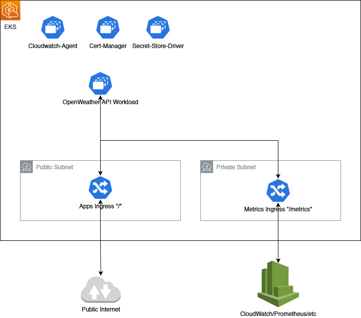
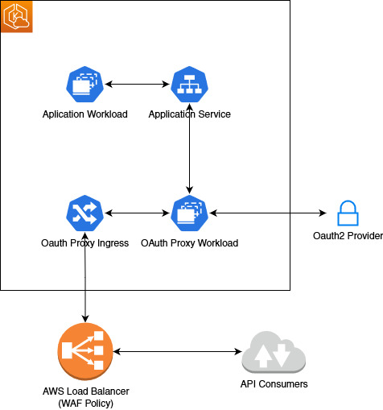

# Open Weather API Coding Challenge

## Notes on Missing Elements

Things I would implement given more time

 - More robust error handling at the application itself.
 - Swagger to provide basic documentation
 - A better pattern to create and send HTTP responses
 - A working Secret Store Driver Implementation
 - Promethus Metrics into Cloudwatch at the Workload Level
 - A Custom Metrics API inside Kubernetes to allow for scaling off custom metrics

Things I would consider if the app were to be productionized

 - Auto-scaling based on CPU/Memory usage or number of requests
 - Deployment in other regions and routing via CloudFront or a similar Geo service (Azure Traffic Manager)
 - Blue/Green Cluster deployment to protect against cluster outages with regular switchover testing

# Infrastructure Planning

I have chosen EKS for this deployment as I am already familiar with it. If more planning time was available I might have chosen ECS or Lambda for this task. The current deployment utilizes a single Load Balancer and Ingress Class, however given more time I would split the traffic between an internal and external ingress and possible bring a secondary node pool online to handle cluster tooling as cost and requirements permitted. 

The application is stateless so there is no need for a database or storage solution.

# Scaling and Capacity

For this demonstration I have elected to run on a few nodes for cost purposes. However if I was to deploy this in the production environment I would consider using EKS's Cluster Autoscaler combined with pod Anti-Affinity settings to keep the workloads on seperate nodes. In regards to scaling the workload itself I would implement a horizontal pod autoscaler in the workload. This would be tied to the CPU and Memory metrics if there were no custom metrics for the application, however if the application did provide custom metrics I would look to work with the developer to estrablish thresholds for scaling or for a simple web based workload I might scale off number of requests.

In the case of a high traffic application we might consider caching some of the query responses into Redis or a document DB and serving self-hosted data instead of contacting the OpenWeather API. We would then expire them after a period of time. In an extreme case we might decouple the part of the application that recieves the requests and use an event queue to to make sure that connections don't need to be held open while we wait for capacity on the OpenWeather backend. In this case we would provide a callback url and have a seperate service provide the final response when it is available. This pattern more closely resembles API's that transform a submitted object and then return it to the user in the transformed state and might not be strictly relevant for a weather API.

## Security

At the moment there is a simple check of an API Key header to gate access to the service. This is standing in for a much more elaborate deployment that would include OAuth2 or some kind of OpenID integration. If we were sticking with EKS for this deployment the easiest implementation would be an oauth2 proxy workload with an ingress taking the place of an application ingress. To expand this scope further tokens and accounts would be assigned to specific users to allow for metered billing, rate limiting and logging of usage patterns. This would introduce a database element that should available to the EKS Cluster via a Private VPC.

In regards to further security measures, certainly a WAF policy attached to the Load Balancer would be a requirement along with a rate limiting implementation. In highly secure cases the API might be split into multiple microservices, each controlling authentication, handing requests and calling backend services.

## Metrics and Alarms

In terms of metrics the usual suspects apply CPU Usage and Memory both at a Workload Level and a Node Level. In addition to this Network throughput would also be useful in identidying any misconfigured services or external actors attempting high traffic attacks like a DDOS attack. Disk Space metrics are interesting but probably not that important for a workload like this with no State. Excessive data written to a pod should cause a DiskPressure condition that would show up on pod alerts.

At a Microservice level then container restarts is an important metric as it identifies a pod that may be working mostly fine, but have the odd intermittant issue. Any more than 1 or 2 in a 24 hour period would be cause for investigation. In addition to this workloads that are Crashlooping, Errored, Failed and especially Evicted should also raise alarms. Even the absence of pods might be considered a useful metric.

At the Workload level number of requests should form an important part of the scaling strategy and certainly any requests other than 200 should be tallied and alarmed on once an unacceptable threshold has been reached, especially 4XX and 5XX errors. 4XX might be delegated to a warning as a misconfigured customer may generate a lot in a short period of time.

## Chaos Engineering

At this time I do not profess any real knowledge of Chaos Engineering outside of what is broadly understood in the industry. If I were to utilize Chaos Engineering to test against a workload on EKS I would probably seek out the most applicable package to EKS Workloads. A minimum amount of study shows that AWS recommends Litmus Chaos. 

As far as workflows to run I would be looking to ensure that replicasets had enough redunancy to survive more than one node loss. I would be scaling workloads to ensure that any autoscaling of both nodes and pods were working as desired and that there was no workflow where a workload couldn't be scheduled on a node (Tainted, Not Enough Resources, Not enough nodes that match Affinity or Anti-Affinity).